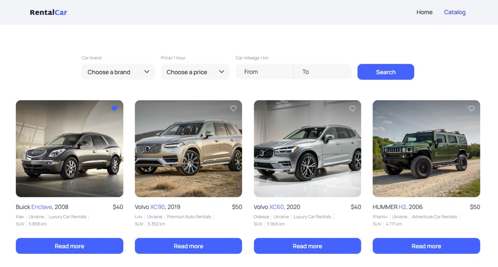

# Car Rental - Web Application [Live demo](https://car-rental-coral.vercel.app/) 


## Project Description

**Car Rental** is the front-end part of a web application built for **RentalCar**, a company specializing in car rentals. This application provides users with an intuitive interface to browse available cars, view detailed information about each vehicle, and easily fill out a rental form.

## Features

- 🏠 **Home Page:** Welcome screen with key information and quick access to the catalog.
- 🚗 **Car Catalog:** Browse the full list of available cars for rent.
- 📄 **Car Details Page:** Detailed description, specifications, and a rental form for each car.

## Installation

To set up the project locally, ensure you have one of the following package managers installed: **npm**, **yarn**, **deno**, or **bun**.

### Steps

1. Clone the repository:
    ```bash
    git clone https://github.com/grizeus/car_rental.git
    ```
2. Navigate to the project directory:
    ```bash
    cd car_rental
    ```
3. Install dependencies (using npm as an example):
    ```bash
    npm install
    ```
4. Run the development server:
    ```bash
    npm run dev
    ```

## Usage

After running the development server, open your browser and visit:
http://localhost:5173/

Explore the homepage, browse the catalog, and try renting a car to see the app in action.

---

## About the Author

**Petro Zaitsev**  
_GitHub_: [grizeus](https://github.com/grizeus)  

As a dedicated front-end developer with a passion for innovation, I'm excited to connect with like-minded professionals in the tech industry. With expertise in **HTML5, CSS3/SASS, JavaScript/TypeScript, Tailwind, React**, and more, I bring digital projects to life through clean code and thoughtful design. When I'm not coding, I’m learning new technologies and collaborating with driven teams to deliver high-quality results.

---

🚀 **Let’s build something great together!**